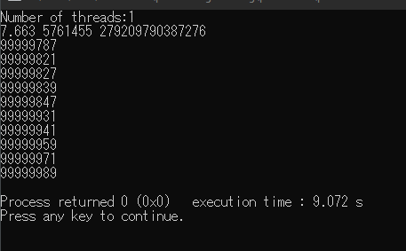
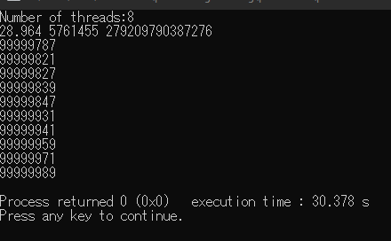

# parallelhw1

# Compiling and running

1-Go to the directory with primes.cpp

2-Run the following command:

__g++ -std=c++11 primes.cpp -o primes -lpthread__

3-Run the following command:

__./primes__

4-Check primes.txt or console for results

# Theory

Finds prime numbers between 2 and 10^8

It works using the Sieve of Eratosthenes algorithm, by using threads on each integer.

The threads take turns taking an integer to calculate with the use of locks and work on them in parallel.

The algorithm has a num_threads variable to test with different threads, this is the runtime when it uses one thread:

Now if we repeat the procress using 8 threads instead

Unfortunately it was not faster, this is due to the way I implemented a parallel sieve.

This is because the locks part of the algorithm, while preventing wrong numbers they also prevent the threads from accessing the integers as soon as they are able, therefore creating a sequential behavior.

In theory, each thread should get one integer and do the calculation for others as they free up.

Another approach to this was to split the workload in ranges of 10^8/8, I was gonna try this at the start but there are two problems with splitting the workload like this:

1-There are a lot more prime numbers within the first interval

2-The bigger the numbers are the more calculation are required

Therefore, the work would not be split evently amongst the thread with this approach, hence why I tried to do it integer by integer.
